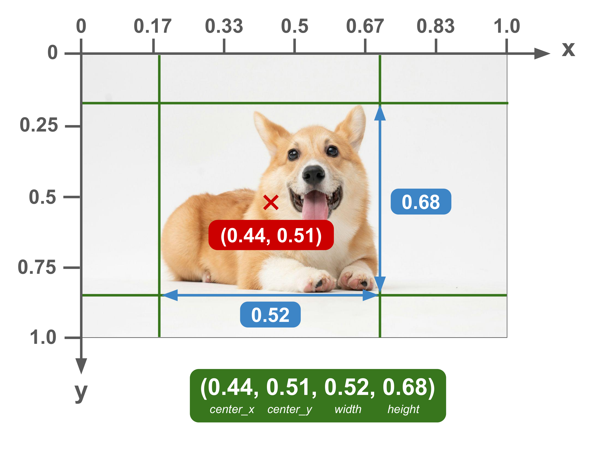

# Probation Task: Going Through Gate with Unity Simulation

This repository contains the probation task, focusing on autonomous gate navigation using Unity simulation integrated with ROS 2.

**You should NOT clone this repository from Mecatron github organization directly.** Instead, you should **fork** this repository to your own github and clone from it *(Please ask ChatGPT how to fork a github repository if you are unsure)*. After you fork and clone the repository, you should be on branch `probation/task`. If you are not on this branch, please switch to it using:
```bash
git checkout probation/task
```

You are supposed to implement your solution in this branch `probation/task`. After you finish the task, please send us the link to your forked repository.

## 1. Problem Statement

**Task Goal**: Navigate an autonomous underwater vehicle (AUV) through a gate in a simulated environment.

**Learning Objectives**:
- Working with a simulation using ROS2
- Process object detection data for meaningful insights
- Develop autonomous decision-making and control algorithms
- Manage a relatively large projects with many processes and nodes.

**Success Criteria**:
- The vehicle navigates autonomously through the gate 3 times, at 3 different random initial positions.

## 2. Setup and Dependencies

### Workspace Structure
```
probation_ws/
├── src/
│   ├── ROS-TCP-Endpoint/          # Unity-ROS bridge
│   └── vision/
│       └── vision_msgs/           # Custom message definitions
```

### Key Components

- **[ROS-TCP-Endpoint](src/ROS-TCP-Endpoint)**: Bridge between Unity simulation and ROS 2
- **[vision_msgs](src/vision/vision_msgs)**: Custom message types for bounding box data
  - [`BoundingBox.msg`](src/vision/vision_msgs/msg/BoundingBox.msg): Single detection with bounding box information (x, y, w, h), confidence, label name and label id.

    

  - [`BoundingBoxArray.msg`](src/vision/vision_msgs/msg/BoundingBoxArray.msg): Array of detections with header

### Prerequisites

1. **ROS 2 Humble** - Full desktop installation
2. **MAVROS** - For vehicle communication and control
   ```bash
   sudo apt install ros-$ROS_DISTRO-mavros
   ```
3. **Unity Simulation** - Provided simulation environment
4. **Foxglove Bridge** - For monitoring various states of the vehicle
   ```bash
   sudo apt install ros-$ROS_DISTRO-foxglove-bridge
   ```

### Installation

0. Fork the repository to your own github account.

1. Clone and build the workspace:
   ```bash
   cd ~
   git clone your_forked_repo_url
   cd probation_ws
   colcon build --symlink-install
   source install/local_setup.bash
   ```

2. Additional setup:

   To avoid repeatedly sourcing the workspace, you may run the following command to add source to `~/.bashrc` file:
   ```bash
   echo "source ~/probation_ws/install/local_setup.bash" >> ~/.bashrc
   ```

If you are unsure about how to run your ROS2 implementation with Unity simulation, please refer to the [Appendix 5.2](#52-proper-setup-flow) for a proper setup flow.

## 3. Things to Note About the Simulation

### Simulation Characteristics

- **Random Initial Position**: The vehicle spawns at a random location and orientation
- **Imperfect Detection**: Objects are only detected approximately 70% of the time
- **Flight Mode Requirement**: Vehicle must be in GUIDED mode for autonomous control via topics. To switch back to control by keyboard, set mode to `ALT_HOLD`.

### Vision System

- Bounding boxes are published from Unity simulation with message type [`vision_msgs/BoundingBoxArray`](src/vision/vision_msgs/msg/BoundingBoxArray.msg)
- Coordinates are normalized (0.0-1.0) relative to image frame

## 4. Suggested Logic Build-up

To support your implementation, here is a suggested logic flow:

1. Implement client to change vehicle to GUIDED mode
2. Move down until reaching target depth for gate visibility
3. Implement search pattern to locate gate
4. Center the gate and moving forward to approach
5. Go straight through the gate

The logic flow above is one of many possible solutions. Feel free to explore and implement your own strategies.

> **NOTE:**
> The vehicle's initial position may sometimes face obstacles. If this occurs, please refer the [Appendix 5.1](#51-obstacle-avoidance-note) for more details.

## 5. Appendix

### 5.1. Obstacle Avoidance Note

In the gate area of the simulation, there is a orange flare in front of the gate which acts as an obstacle. In this case, you may choose to implement obstacle avoidance logic if you wish, and of course it would be a bonus point. However, it is not a requirement for the probation task. 

If you choose not to implement obstacle avoidance, you may reset the simulation if the vehicle's initial position faces an obstacle.

> **NOTE:**  
> We advise you to focus on the main task, which is to go through the gate without obstacle avoidance.  If there is time left, you may then implement obstacle avoidance logic.

### 5.2. Proper Setup Flow

To set up and run the simulation with ROS2 properly, follow these steps before starting your implementation:

1. **Build Workspace**:
   ```bash
   cd probation_ws
   colcon build
   source install/setup.bash
   ```

2. **Start ROS TCP Endpoint**:
   ```bash
   ros2 run ros_tcp_endpoint default_server_endpoint
   ```
   The endpoint will start on `0.0.0.0:10000` by default.

3. **Launch Unity Simulation**:
   - Open the Unity simulation project. If you have not installed the simulation, please refer to our workshop notion page for the download link:
        [Notion Page](https://mecatron.notion.site/ros2)
   - Start the simulation

4. **Verify Communication**:
   ```bash
   # Check available topics
   ros2 topic list
   
   # Check MAVROS connection
   ros2 topic echo /mavros/state
   ```

5. You may now start your ROS2 implementation to control the vehicle.

### 5.3. Notes to Avoid Confusion
#### Publishers

In the `minimal_publisher.py` file, we created a timer to call the timer_callback function every `0.5` seconds. The function publishes a `Float32` message with a value of `0.5` to the topic `/mavros/setpoint_velocity/cmd_vel_unstamped/x` at line 18, by:
```python
self.publisher_.publish(msg)
```

**Important Notes:**

* In order to publish, you don't need to have a timer
* You can call it anywhere: in a subscriber callback, service callback, or even in the class constructor (__init__).
* The timer is just a convenient way to call a function periodically.

### 5.4. Useful Reference

#### Useful commands
```bash
# Monitor system status
ros2 topic echo /mavros/state

# Check available topics, services
ros2 topic list
ros2 service list

# Set vehicle mode
ros2 service call /mavros/set_mode mavros_msgs/srv/SetMode "{base_mode: 0, custom_mode: 'GUIDED'}"

```

#### Useful links

- [ROS2 Official Tutorials](https://docs.ros.org/en/humble/Tutorials.html)

---

**Good luck with your probation task!** Focus on understanding the integration between simulation, vision processing, and vehicle control. The key is building a robust system that handles the imperfect nature of real-world sensing and control.


